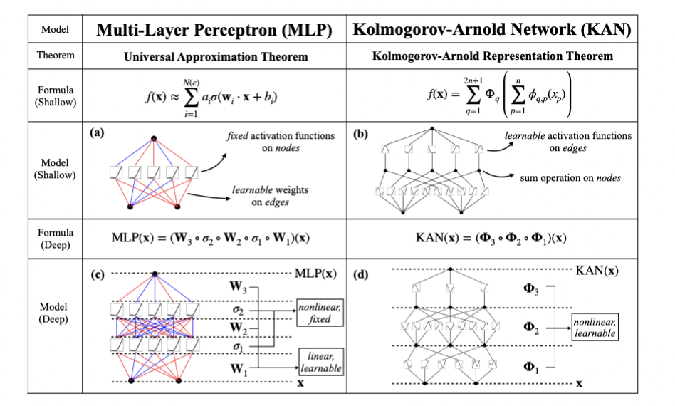

# KAN: Kolmogorov-Arnold-Network
NAML project at polimi in 2024-2025

GRADE ?/30

## Introduction

Multi-layer perceptrons (MLPs), also known as fully-connected feedforward neural networks, are foundational building blocks of today’s deep learning models. The importance of MLPs can never be overstated, since they are the default models in machine learning for approximating non-linear functions, due to their expressive power guaranteed by the universal approximation theorem. 

However, are MLPs the best non-linear regressors we can build? Despite the prevalent use of MLPs, they have significant drawbacks. In transformers, for example, MLPs consume almost all non-embedding parameters and are typically less interpretable (relative to attention layers) without post-analysis tools.

We propose a promising alternative to MLPs, called Kolmogorov-Arnold Networks (KANs). 

Whereas MLPs are inspired by the universal approximation theorem, KANs are inspired by the Kolmogorov-Arnold representation theorem. Like MLPs, KANs have fully-connected structures. However, while MLPs place fixed activation functions on nodes “neurons”), KANs place learnable activation functions on edges (“weights”). As a result, KANs have no linear weight matrices at all: instead, each weight parameter is replaced by a learnable 1D function parametrized as a spline. KANs’ nodes simply sum incoming signals without applying any non-linearities. 

One might worry that KANs are hopelessly expensive, since each MLP’s weight parameter becomes KAN’s spline function. Fortunately, KANs usually allow much smaller computation graphs than MLPs embedding a 2-hidden-layer neural network.

Throughout this paper, we will show that KANs can lead to higher accuracy and improved interpretability over MLPs. We will show how, by leveraging the Kolmogorov-Arnold representation theorem, learnable activation functions and the absence of fixed-weight matrices allow KANs to efficiently capture complex relationships within the data.

## Paper and Presentation
[KANs_paper.pdf](KANs_paper.pdf): the Kolmogorov-Arnold-Network paper 

[KANs_presentation.ppt](): the Kolmogorov-Arnold-Network ppt presentation

## Code
[KANs_code.ipynb](KANs_code.ipynb): the Kolmogorov-Arnold-Network code example
